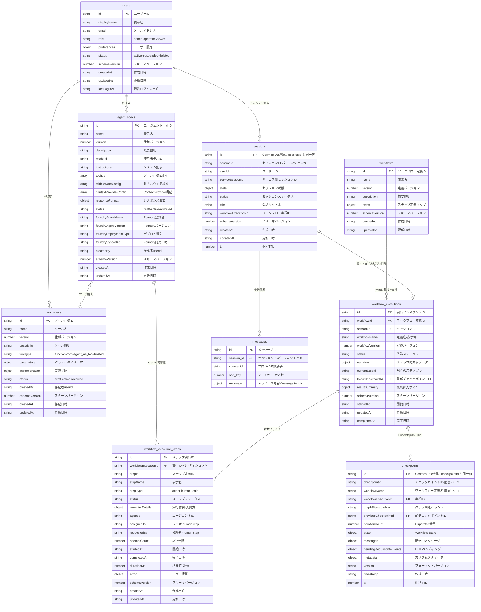

# Cosmos DB データ定義書

MAF（Microsoft Agent Framework）ベースのエージェント実行管理基盤における Cosmos DB の設計仕様。
プラットフォーム管理 8 コンテナ + MAF 自動作成 1 コンテナ（messages）のフィールド定義、パーティションキー設計、インデキシング、同時実行制御、スループット戦略を網羅する。

> **根拠**: [cosmosdb-best-practices skill](/.github/skills/cosmosdb-best-practices/) + MAF SDK ソースコード

---

## 1. アカウント構成

```
Cosmos DB Account (NoSQL API)
├── Database: "maf"
│   ├── agent_specs                  ← Spec 系（共有スループット）
│   ├── tool_specs                   ← Spec 系（共有スループット）
│   ├── workflows                    ← Spec 系（共有スループット）
│   ├── workflow_executions          ← Runtime 系（共有スループット）
│   ├── workflow_execution_steps     ← Runtime 系（共有スループット）
│   ├── checkpoints                  ← Runtime 系（共有スループット）
│   ├── sessions                     ← Session 系（共有スループット）
│   ├── messages                     ← Session 系（専用スループット）
│   └── users                        ← Platform 系（共有スループット）
│
│   ※ Foundry Standard Setup で同一アカウントを BYO 指定した場合:
│   ├── (Foundry 管理コンテナ)        ← Foundry が自動作成・管理
│   └── (Foundry 管理コンテナ)        ← スキーマは Foundry 独自
```

> **BYO (Bring Your Own) Cosmos DB**: Foundry Standard Setup 時に `azureCosmosDBAccountResourceId` で自前アカウントを指定可能。Foundry が Thread/Message/File 用のコンテナを同一アカウント内に自動作成する。自前コンテナとは名前空間が分離されるため競合しない。ただしプロジェクトあたり 3 コンテナ × 1000 RU/s が追加で必要。

---

## 2. コンテナ一覧

| # | コンテナ名 | 分類 | パーティションキー | TTL | 概要 |
|---|-----------|------|-----------------|-----|------|
| 1 | `agent_specs` | Spec | `/id` | — | エージェント仕様（モデル・指示・ツール構成） |
| 2 | `tool_specs` | Spec | `/id` | — | ツール仕様（関数定義・パラメータスキーマ） |
| 3 | `workflows` | Spec | `/id` | — | ワークフロー定義（ステップ構成） |
| 4 | `workflow_executions` | Runtime | `/id` | — | ワークフロー実行インスタンス |
| 5 | `workflow_execution_steps` | Runtime | `/workflowExecutionId` | — | ステップ実行レコード |
| 6 | `checkpoints` | Runtime | 階層: `/workflowName`, `/checkpointId` | 30 日 | MAF チェックポイント |
| 7 | `sessions` | Session | `/sessionId` | ドキュメント個別 | チャットセッション（AgentSession 永続化） |
| 8 | `messages` | Session | `/session_id` | — | 会話履歴（**CosmosHistoryProvider 管理**） |
| 9 | `users` | Platform | `/id` | — | ユーザー情報（認証・認可の基盤） |

### PK 設計方針

- **Spec 系** (`agent_specs`, `tool_specs`, `workflows`): 件数が限定的（数百件以下）のため、PK `/id` でポイントリード（1 RU）を最優先。一覧系クエリのクロスパーティションコストは許容する。件数が 1,000 件を超える場合は PK 再設計を検討。
- **Runtime 系** (`workflow_executions`): ポイントリードが主要アクセスパターンのため PK `/id`。`workflow_execution_steps`: 実行 ID 単位でまとめて取得するため PK `/workflowExecutionId`。`checkpoints`: MAF `CheckpointStorage` Protocol のアクセスパターンに整合させた階層 PK。
- **Session 系** (`sessions`): セッション単位でのポイントリードが主。`messages`: MAF `CosmosHistoryProvider` が PK `/session_id` で管理。
- **Platform** (`users`): Spec 系と同様、PK `/id` でポイントリード最適化。

---

## 3. ER 図



---

## 4. コンテナ別フィールド定義

### 4.1 agent_specs（エージェント仕様）

MAF の `ChatAgent` 構築に必要な設定を永続化する。`spec_management` サービスで CRUD し、実行時に `PlatformAgentBuilder` で `ChatAgent` インスタンスに変換する。

> **共通/UC固有**: 共通定義。`agents/` のコード定義を DB に登録する形。UC 固有エージェントも同じスキーマで管理。

| # | 論理名 | 物理名 | データ型 | NULL | 説明 |
|---|--------|--------|---------|------|------|
| 1 | エージェント仕様ID | `id` | string | — | パーティションキー兼用。UUID |
| 2 | エージェント名 | `name` | string | — | kebab-case。MAF Agent `name` に対応 |
| 3 | 仕様バージョン | `version` | number | — | major。同一 name で複数バージョン共存可 |
| 4 | 概要説明 | `description` | string | ○ | |
| 5 | 使用モデルID | `modelId` | string | — | Azure OpenAI デプロイメント名 |
| 6 | システム指示 | `instructions` | string | — | MAF Agent `instructions` に対応 |
| 7 | ツール構成 | `toolIds` | array\<string\> | ○ | `tool_specs.id` の配列。実行時に解決 |
| 8 | ミドルウェア構成 | `middlewareConfig` | array\<object\> | ○ | `[{ type, config }]` 形式。実行時にミドルウェアインスタンス化 |
| 9 | ContextProvider構成 | `contextProviderConfig` | array\<object\> | ○ | `[{ type, config }]` 形式。HistoryProvider設定等 |
| 10 | レスポンス形式 | `responseFormat` | object | ○ | Structured Output 用の JSON Schema |
| 11 | ステータス | `status` | string | — | `draft` / `active` / `archived` |
| 12 | Foundry登録名 | `foundryAgentName` | string | ○ | Foundry Agent Service 上の `name`（最大63文字、英数字+ハイフン） |
| 13 | Foundryバージョン | `foundryAgentVersion` | string | ○ | Foundry AgentVersion ID。ロールバック時の参照用 |
| 14 | デプロイ種別 | `foundryDeploymentType` | string | ○ | `prompt` / `hosted` / `workflow` / `none`。Foundry 未連携時は `none` |
| 15 | Foundry同期日時 | `foundrySyncedAt` | string (ISO 8601) | ○ | 最後に Foundry へ同期した日時 |
| 16 | 作成者 | `createdBy` | string | — | `users.id` への参照 |
| 17 | スキーマバージョン | `schemaVersion` | number | — | ドキュメントスキーマバージョン。初期値 `1` |
| 18 | 作成日時 | `createdAt` | string (ISO 8601) | — | |
| 19 | 更新日時 | `updatedAt` | string (ISO 8601) | — | |

**キー:**

| 種別 | 対象 |
|------|------|
| パーティションキー | `/id` |
| 外部参照 | `toolIds[]` → `tool_specs.id` |
| 外部参照 | `createdBy` → `users.id` |

> **name + version のユニーク性**: 同一 `name` に対して `version` が一意であることはアプリ層で保証する。Cosmos DB にはユニーク制約がないため、`spec_management` サービスで重複チェックを行う。

> **コード定義との関係**: `agents/` にコードとして定義された Agent も、起動時に `agent_specs` に登録（upsert）する運用を想定。API からの動的登録と共存可能。

---

### 4.2 tool_specs（ツール仕様）

MAF の Tool（`@tool`, `FunctionTool`, MCP, Agent-as-Tool）の仕様を永続化する。

> **共通/UC固有**: 共通定義。

| # | 論理名 | 物理名 | データ型 | NULL | 説明 |
|---|--------|--------|---------|------|------|
| 1 | ツール仕様ID | `id` | string | — | パーティションキー兼用。UUID |
| 2 | ツール名 | `name` | string | — | snake_case・動詞始まり。MAF Tool `name` に対応 |
| 3 | 仕様バージョン | `version` | number | — | major |
| 4 | ツール説明 | `description` | string | — | MAF Tool `description` に対応。LLM がツール選択時に参照 |
| 5 | ツール種別 | `toolType` | string | — | `"function"` / `"mcp"` / `"agent_as_tool"` / `"hosted"` |
| 6 | パラメータスキーマ | `parameters` | object | ○ | JSON Schema 形式。function type の引数定義 |
| 7 | 実装参照 | `implementation` | object | — | ツール種別に応じた実装情報（下記参照） |
| 8 | ステータス | `status` | string | — | `draft` / `active` / `archived` |
| 9 | 作成者 | `createdBy` | string | — | `users.id` への参照 |
| 10 | スキーマバージョン | `schemaVersion` | number | — | ドキュメントスキーマバージョン。初期値 `1` |
| 11 | 作成日時 | `createdAt` | string (ISO 8601) | — | |
| 12 | 更新日時 | `updatedAt` | string (ISO 8601) | — | |

**`implementation` フィールドの構造（toolType 別）:**

```jsonc
// toolType: "function"
{
  "module": "src.platform.tools.search",
  "function": "search_documents"
}

// toolType: "mcp"
{
  "serverName": "bing-search",
  "toolName": "web_search"
}

// toolType: "agent_as_tool"
{
  "agentSpecId": "<agent_specs.id>"
}

// toolType: "hosted"
{
  "provider": "azure_ai_search",
  "config": { "indexName": "..." }
}
```

**キー:**

| 種別 | 対象 |
|------|------|
| パーティションキー | `/id` |
| 外部参照 | `createdBy` → `users.id` |

---

### 4.3 workflows（ワークフロー定義）

ワークフローの大枠を定義する。どんなステップ（stepId, stepName, stepType, order）で構成されるかをマップとして保持する。WorkflowExecution は作成時にこの定義を参照し、`workflowId` で紐付く。

> **共通/UC固有**: 共通定義。複数の UC で共有される想定。

| # | 論理名 | 物理名 | データ型 | NULL | 説明 |
|---|--------|--------|---------|------|------|
| 1 | ワークフロー定義ID | `id` | string | — | パーティションキー兼用 |
| 2 | 表示名 | `name` | string | — | |
| 3 | 定義バージョン | `version` | number | — | major のみ |
| 4 | 概要説明 | `description` | string | ○ | |
| 5 | ステップ定義マップ | `steps` | object | — | stepId → { stepName, stepType, order } のマップ |
| 6 | スキーマバージョン | `schemaVersion` | number | — | ドキュメントスキーマバージョン。初期値 `1` |
| 7 | 作成日時 | `createdAt` | string (ISO 8601) | — | |
| 8 | 更新日時 | `updatedAt` | string (ISO 8601) | — | |

> `workflow_execution_steps.stepId` はこのマップのキーに対応する。

**キー:**

| 種別 | 対象 |
|------|------|
| パーティションキー | `/id` |

---

### 4.4 workflow_executions（ワークフロー実行インスタンス）

ワークフローの実行状態を管理する。

> **共通/UC固有**: 共通定義。`variables` に UC 固有のデータを格納する。

| # | 論理名 | 物理名 | データ型 | NULL | 説明 |
|---|--------|--------|---------|------|------|
| 1 | 実行ID | `id` | string | — | パーティションキー兼用 |
| 2 | ワークフロー定義ID | `workflowId` | string | — | `workflows.id` への参照 |
| 3 | セッションID | `sessionId` | string | ○ | `sessions.sessionId` への参照。チャット起点の実行時に設定 |
| 4 | 定義名 | `workflowName` | string | — | 表示用 |
| 5 | 定義バージョン | `workflowVersion` | number | — | |
| 6 | 業務ステータス | `status` | string | — | idle / running / waiting / completed / failed / suspended / cancelled / timed_out |
| 7 | ステップ間共有データ | `variables` | object | ○ | UC 固有の業務データを格納 |
| 8 | 現在のステップID | `currentStepId` | string | ○ | |
| 9 | 最新チェックポイントID | `latestCheckpointId` | string | ○ | `checkpoints.checkpointId` への参照 |
| 10 | 最終出力サマリ | `resultSummary` | object | ○ | |
| 11 | 実行開始者 | `createdBy` | string | — | `users.id` への参照 |
| 12 | 最終更新者 | `updatedBy` | string | — | `users.id` への参照 |
| 13 | スキーマバージョン | `schemaVersion` | number | — | ドキュメントスキーマバージョン。初期値 `1` |
| 14 | 開始日時 | `startedAt` | string (ISO 8601) | — | |
| 15 | 更新日時 | `updatedAt` | string (ISO 8601) | — | |
| 16 | 完了日時 | `completedAt` | string (ISO 8601) | ○ | |

**ステータス遷移:**

正常系: `idle` -> `running` -> `waiting`(HITL) -> `running` -> `completed`

例外系: `running` -> `failed` / `timed_out` / `suspended` / `cancelled`。`suspended` -> `running`（再開）。

**キー:**

| 種別 | 対象 |
|------|------|
| パーティションキー | `/id` |
| 外部参照 | `workflowId` → `workflows.id` |
| 外部参照 | `sessionId` → `sessions.sessionId` |
| 外部参照 | `latestCheckpointId` → `checkpoints.checkpointId` |
| 外部参照 | `createdBy` → `users.id` |

---

### 4.5 workflow_execution_steps（ステップ実行レコード）

各ステップの実行状態・結果・入出力を記録する。

> **共通/UC固有**: 共通定義。`executorDetails` に UC 固有の入出力を格納する。

| # | 論理名 | 物理名 | データ型 | NULL | 説明 |
|---|--------|--------|---------|------|------|
| 1 | ステップ実行ID | `id` | string | — | |
| 2 | 実行ID | `workflowExecutionId` | string | — | パーティションキー。`workflow_executions.id` への参照 |
| 3 | ステップ定義ID | `stepId` | string | — | `workflows.steps[].stepId` に対応 |
| 4 | 表示名 | `stepName` | string | — | |
| 5 | ステップ種別 | `stepType` | string | — | `"agent"` / `"human"` / `"logic"` |
| 6 | ステップステータス | `status` | string | — | idle / running / waiting / completed / failed / skipped |
| 7 | 実行詳細 | `executorDetails` | object | ○ | stepType に応じた入出力（UC固有） |
| 8 | エージェントID | `agentId` | string | ○ | agent step のみ |
| 9 | 担当者 | `assignedTo` | string | ○ | human step のみ |
| 10 | 依頼者 | `requestedBy` | string | ○ | human step のみ |
| 11 | 試行回数 | `attemptCount` | number | — | 1始まり。リトライ時にインクリメント |
| 12 | 開始日時 | `startedAt` | string (ISO 8601) | ○ | |
| 13 | 完了日時 | `completedAt` | string (ISO 8601) | ○ | |
| 14 | 所要時間 | `durationMs` | number | ○ | ミリ秒 |
| 15 | エラー情報 | `error` | object | ○ | `{ code, message, detail, occurredAt }` |
| 16 | スキーマバージョン | `schemaVersion` | number | — | ドキュメントスキーマバージョン。初期値 `1` |
| 17 | 作成日時 | `createdAt` | string (ISO 8601) | — | |
| 18 | 更新日時 | `updatedAt` | string (ISO 8601) | — | |

**キー:**

| 種別 | 対象 |
|------|------|
| パーティションキー | `/workflowExecutionId` |
| 外部参照 | `workflowExecutionId` → `workflow_executions.id` |

> **再試行の扱い**: step が失敗して再試行される場合、失敗レコードはそのまま残し、新しいレコードを append する。current state は `attemptCount` が最大のレコードで判断する。

**`executorDetails` の stepType 別構造:**

各 UC 固有の input / output のスキーマは UC 実装時に定義する。以下は共通構造。

**agent:**

| 項目 | 型 | 説明 |
|------|------|------|
| `input` | object | エージェントへの入力データ |
| `output` | object | エージェントの出力データ |
| `modelId` | string | 使用モデル ID |
| `tokenUsage` | object | `{ promptTokens, completionTokens, totalTokens }` |
| `latencyMs` | number | 推論所要時間（ms） |

**human:**

| 項目 | 型 | 説明 |
|------|------|------|
| `input` | object | 担当者に提示するデータ |
| `response` | object | 担当者の入力・操作結果 |
| `respondedBy` | string | 操作者 ID |
| `respondedAt` | string | 操作日時（ISO 8601） |

**logic:**

| 項目 | 型 | 説明 |
|------|------|------|
| `input` | object | ロジックへの入力データ |
| `output` | object | ロジックの出力データ |

---

### 4.6 checkpoints（MAF チェックポイント）

MAF の `CheckpointStorage` Protocol を実装するエンティティ。Superstep ごとにワークフロー実行の状態スナップショットを保存する。

> **共通/UC固有**: 共通定義。

| # | 論理名 | 物理名 | データ型 | NULL | 説明 |
|---|--------|--------|---------|------|------|
| 1 | Cosmos ID | `id` | string | — | **Cosmos DB 必須プロパティ**。`checkpointId` と同一値を設定 |
| 2 | チェックポイントID | `checkpointId` | string | — | UUID。階層 PK Level 2。`id` と同値 |
| 3 | ワークフロー定義名 | `workflowName` | string | — | 階層 PK Level 1。MAF `WorkflowCheckpoint.workflow_name` に対応 |
| 4 | ワークフロー実行ID | `workflowExecutionId` | string | — | `workflow_executions.id` への参照 |
| 5 | グラフ構造ハッシュ | `graphSignatureHash` | string | — | SHA256。グラフトポロジー変更検出用 |
| 6 | 前チェックポイントID | `previousCheckpointId` | string | ○ | `checkpoints.checkpointId` への参照（チェーン） |
| 7 | 作成日時 | `timestamp` | string (ISO 8601) | — | |
| 8 | Superstep番号 | `iterationCount` | number | — | |
| 9 | Workflow State | `state` | object | — | MAF シリアライズデータ（エグゼキュータ状態含む） |
| 10 | 転送中メッセージ | `messages` | object | — | MAF シリアライズデータ（エグゼキュータ間メッセージ） |
| 11 | HITLペンディング | `pendingRequestInfoEvents` | object | ○ | HITL待機中のリクエスト |
| 12 | メタデータ | `metadata` | object | ○ | カスタムメタデータ |
| 13 | フォーマットバージョン | `version` | string | — | `"1.0"` |
| 14 | TTL | `ttl` | number | ○ | ドキュメント個別 TTL。デフォルト TTL を上書き可能 |

**キー:**

| 種別 | 対象 |
|------|------|
| 階層パーティションキー | Level 1: `/workflowName`, Level 2: `/checkpointId` |
| 外部参照 | `workflowExecutionId` → `workflow_executions.id` |

**TTL:** コンテナ `defaultTimeToLive = 2592000`（30 日）。重要な checkpoint は `ttl = -1`（無期限）で個別上書き可能。

> **階層 PK 設計意図**: MAF `CheckpointStorage` Protocol のアクセスパターンに完全整合させる。
>
> | Protocol メソッド | 引数 | PK Level 利用 |
> |-----------------|------|--------------|
> | `list_checkpoints(workflow_name)` | workflow_name | ✅ Level 1 のみ → 単一 workflow のチェックポイント一覧 |
> | `get_latest(workflow_name)` | workflow_name | ✅ Level 1 のみ → timestamp DESC で最新取得 |
> | `load(checkpoint_id)` | checkpoint_id | ✅ Level 1 + 2 でポイントリード（workflow_name は実装側でキャッシュ or クエリ） |
> | `save(checkpoint)` | WorkflowCheckpoint | ✅ Level 1 + 2 で書き込み |
> | `delete(checkpoint_id)` | checkpoint_id | ✅ Level 1 + 2 で削除 |
>
> `load` / `delete` で `checkpoint_id` しか渡されない場合、`workflow_name` をどう解決するかは実装で対応:
> - **案 1**: アプリ層で workflow_name → checkpoint_id のマッピングを保持
> - **案 2**: checkpoint_id に workflow_name のプレフィックスを含める（例: `{workflow_name}:{uuid}`）
> - **案 3**: checkpoint_id のみで Level 1 を省略してクエリ（フォールバック。RU は増加するが頻度は低い）

---

### 4.7 sessions（チャットセッション）

MAF の `AgentSession` を永続化するエンティティ。ユーザーとの会話セッションを管理する。

> **共通/UC固有**: 共通定義。`state` に UC 固有のセッションデータを格納する。

| # | 論理名 | 物理名 | データ型 | NULL | 説明 |
|---|--------|--------|---------|------|------|
| 1 | Cosmos ID | `id` | string | — | **Cosmos DB 必須プロパティ**。`sessionId` と同一値を設定 |
| 2 | セッションID | `sessionId` | string | — | パーティションキー兼用。`AgentSession.session_id` に対応。`id` と同値 |
| 3 | ユーザーID | `userId` | string | — | セッション所有者 |
| 4 | サービスセッションID | `serviceSessionId` | string | ○ | `AgentSession.service_session_id`。Foundry Conversation ID 等の外部サービス管理ID |
| 5 | セッション状態 | `state` | object | ○ | `AgentSession.state`。各 ContextProvider が `source_id` をキーに名前空間分離して格納 |
| 6 | セッションステータス | `status` | string | — | active / closed / expired |
| 7 | タイトル | `title` | string | ○ | 会話タイトル（UI表示用、最初のメッセージから自動生成等） |
| 8 | ワークフロー実行ID | `workflowExecutionId` | string | ○ | セッションに紐づくワークフロー実行（存在する場合） |
| 9 | 作成日時 | `createdAt` | string (ISO 8601) | — | |
| 10 | 更新日時 | `updatedAt` | string (ISO 8601) | — | |
| 11 | スキーマバージョン | `schemaVersion` | number | — | ドキュメントスキーマバージョン。初期値 `1` |
| 12 | TTL | `ttl` | number | ○ | Cosmos DB TTL（秒）。expired セッションの自動削除用 |

**キー:**

| 種別 | 対象 |
|------|------|
| パーティションキー | `/sessionId` |
| 外部参照 | `workflowExecutionId` → `workflow_executions.id` |

> **AgentSession との対応**: MAF の `AgentSession` は `session_id`, `service_session_id`, `state` のみ持つ軽量コンテナ。`userId`, `status`, `title` 等はアプリ層で追加するカスタムフィールド。`AgentSession.to_dict()` / `from_dict()` でシリアライズ時は `sessionId`, `serviceSessionId`, `state` のみが対象。

> **Foundry 連携時の動作**: `serviceSessionId` に Foundry Conversation ID が設定されている場合、Foundry がサーバー側で会話履歴を管理する。この場合 `messages` コンテナの `HistoryProvider` は `load_messages=False`（監査/バックアップ用）に設定し、二重管理を回避する。Foundry 非連携（`serviceSessionId = null`）時は自前 `messages` がプライマリストア。

---

### 4.8 messages（会話履歴）

MAF の `CosmosHistoryProvider` が管理するコンテナ。**スキーマ・コンテナ作成は CosmosHistoryProvider に委譲する。**

> **共通/UC固有**: 共通定義。**TTL なし**（会話履歴は永続保持）。

`CosmosHistoryProvider` は `create_container_if_not_exists` でコンテナを自動作成し、以下のスキーマでドキュメントを管理する:

| # | 論理名 | 物理名 | データ型 | NULL | 説明 |
|---|--------|--------|---------|------|------|
| 1 | メッセージID | `id` | string | — | UUID（SDK 自動生成） |
| 2 | セッションID | `session_id` | string | — | パーティションキー。`sessions.sessionId` に対応 |
| 3 | プロバイダ識別子 | `source_id` | string | — | `HistoryProvider.source_id`。複数プロバイダの識別用 |
| 4 | ソートキー | `sort_key` | number | — | ナノ秒タイムスタンプ + インデックス。順序保証用 |
| 5 | メッセージ内容 | `message` | object | — | `Message.to_dict()` の結果（role, contents, author_name 等を含む dict） |

> **フィールド命名**: MAF SDK は **snake_case** を使用する。設計書の他コンテナ（自前管理）は camelCase だが、`messages` は SDK 管理のため snake_case に従う。

**キー:**

| 種別 | 対象 |
|------|------|
| パーティションキー | `/session_id` |
| 外部参照 | `session_id` → `sessions.sessionId` |

**標準クエリ（CosmosHistoryProvider 内部）:**

```sql
SELECT c.message FROM c
WHERE c.session_id = @session_id AND c.source_id = @source_id
ORDER BY c.sort_key ASC
```

> **CosmosHistoryProvider 準拠**: MAF の `CosmosHistoryProvider` は `session_id` パーティション + `sort_key` 順序で管理する。バッチ操作は 100 件単位の `execute_item_batch` で upsert。`clear(session_id)` でセッション全メッセージ削除可能。
>
> **カスタムフィールド追加**: 監査ログ等でカスタムフィールドが必要な場合は `CosmosHistoryProvider` を継承して `save_messages` をオーバーライドする。

---

### 4.9 users（ユーザー）

プラットフォーム利用者の情報を管理する。`sessions.userId` や `*_specs.createdBy` の実体。

> **共通/UC固有**: 共通定義。認証プロバイダ（Entra ID 等）から同期する想定。

| # | 論理名 | 物理名 | データ型 | NULL | 説明 |
|---|--------|--------|---------|------|------|
| 1 | ユーザーID | `id` | string | — | パーティションキー兼用。Entra ID の OID 等 |
| 2 | 表示名 | `displayName` | string | — | |
| 3 | メールアドレス | `email` | string | ○ | |
| 4 | ロール | `role` | string | — | `admin` / `operator` / `viewer` |
| 5 | ユーザー設定 | `preferences` | object | ○ | UI設定、通知設定等 |
| 6 | ステータス | `status` | string | — | `active` / `suspended` / `deleted` |
| 7 | スキーマバージョン | `schemaVersion` | number | — | ドキュメントスキーマバージョン。初期値 `1` |
| 8 | 作成日時 | `createdAt` | string (ISO 8601) | — | |
| 9 | 更新日時 | `updatedAt` | string (ISO 8601) | — | |
| 10 | 最終ログイン日時 | `lastLoginAt` | string (ISO 8601) | ○ | |

**キー:**

| 種別 | 対象 |
|------|------|
| パーティションキー | `/id` |

> **認証連携**: ユーザーの認証自体は Entra ID 等の外部プロバイダで行う。このコンテナはプラットフォーム内でのプロフィール・権限管理用。初回ログイン時に Entra ID のクレーム情報から自動作成する運用を想定。

---

## 5. インデキシングポリシー

全コンテナで **exclude-all-first**（デフォルト全除外 → 必要なパスのみ追加）を採用する。
書き込み RU を 20-80% 削減し、大きな object フィールド（`state`, `messages`, `executorDetails` 等）のインデックス更新コストを排除する。

### 5.1 agent_specs

```json
{
    "indexingMode": "consistent",
    "excludedPaths": [{ "path": "/*" }],
    "includedPaths": [
        { "path": "/name/?" },
        { "path": "/version/?" },
        { "path": "/status/?" },
        { "path": "/foundryDeploymentType/?" }
    ]
}
```

### 5.2 tool_specs

```json
{
    "indexingMode": "consistent",
    "excludedPaths": [{ "path": "/*" }],
    "includedPaths": [
        { "path": "/name/?" },
        { "path": "/toolType/?" },
        { "path": "/status/?" }
    ]
}
```

### 5.3 workflows

```json
{
    "indexingMode": "consistent",
    "excludedPaths": [{ "path": "/*" }],
    "includedPaths": [
        { "path": "/name/?" },
        { "path": "/version/?" }
    ]
}
```

### 5.4 workflow_executions

```json
{
    "indexingMode": "consistent",
    "excludedPaths": [{ "path": "/*" }],
    "includedPaths": [
        { "path": "/workflowId/?" },
        { "path": "/sessionId/?" },
        { "path": "/status/?" },
        { "path": "/startedAt/?" }
    ],
    "compositeIndexes": [
        [
            { "path": "/status", "order": "ascending" },
            { "path": "/startedAt", "order": "descending" }
        ]
    ]
}
```

### 5.5 workflow_execution_steps

```json
{
    "indexingMode": "consistent",
    "excludedPaths": [{ "path": "/*" }],
    "includedPaths": [
        { "path": "/stepId/?" },
        { "path": "/status/?" },
        { "path": "/startedAt/?" },
        { "path": "/attemptCount/?" }
    ]
}
```

### 5.6 checkpoints

```json
{
    "indexingMode": "consistent",
    "excludedPaths": [{ "path": "/*" }],
    "includedPaths": [
        { "path": "/workflowName/?" },
        { "path": "/workflowExecutionId/?" },
        { "path": "/timestamp/?" },
        { "path": "/iterationCount/?" }
    ]
}
```

### 5.7 sessions

```json
{
    "indexingMode": "consistent",
    "excludedPaths": [{ "path": "/*" }],
    "includedPaths": [
        { "path": "/userId/?" },
        { "path": "/status/?" },
        { "path": "/createdAt/?" }
    ]
}
```

### 5.8 messages

```json
{
    "indexingMode": "consistent",
    "excludedPaths": [{ "path": "/*" }],
    "includedPaths": [
        { "path": "/session_id/?" },
        { "path": "/source_id/?" },
        { "path": "/sort_key/?" }
    ]
}
```

> **注意**: `messages` コンテナは CosmosHistoryProvider が `create_container_if_not_exists` で作成するため、デフォルトポリシーになる。インデキシングポリシーを適用するには、コンテナを事前作成するか、作成後にポリシーを更新する。

### 5.9 users

```json
{
    "indexingMode": "consistent",
    "excludedPaths": [{ "path": "/*" }],
    "includedPaths": [
        { "path": "/email/?" },
        { "path": "/role/?" },
        { "path": "/status/?" }
    ]
}
```

---

## 6. 楽観的同時実行制御（ETag）

読み取り→変更→書き込み（read-modify-write）パターンでは、ETag ベースの楽観的同時実行制御を使用する。

### 6.1 適用対象

| コンテナ | ETag レベル | 対象操作 | 理由 |
|---------|-----------|---------|------|
| `workflow_executions` | **必須** | status / currentStepId / variables の更新 | 並行ステップ完了による lost update 防止 |
| `sessions` | **必須** | state の更新 | 複数 ContextProvider の同時更新防止 |
| `agent_specs` | 推奨 | 全フィールド更新 | 複数管理者による同時 spec 更新の保護 |
| `tool_specs` | 推奨 | 全フィールド更新 | 同上 |
| `users` | 任意 | — | 頻繁な同時更新は想定しにくい |

### 6.2 実装パターン（Python）

```python
from azure.core import MatchConditions
from azure.cosmos.exceptions import CosmosHttpResponseError

MAX_RETRIES = 3

async def update_with_etag(
    container: ContainerProxy,
    item_id: str,
    partition_key: str,
    update_fn: Callable[[dict], dict],
) -> dict:
    """ETag ベースの楽観的同時実行制御付き更新。"""
    for attempt in range(MAX_RETRIES):
        item = await container.read_item(item=item_id, partition_key=partition_key)
        etag = item.get("_etag")

        updated = update_fn(item)

        try:
            return await container.upsert_item(
                body=updated,
                etag=etag,
                match_condition=MatchConditions.IfNotModified,
            )
        except CosmosHttpResponseError as e:
            if e.status_code == 412 and attempt < MAX_RETRIES - 1:
                continue  # リトライ: 再読み取り → 再更新
            raise
    raise RuntimeError(f"Failed to update {item_id} after {MAX_RETRIES} attempts")
```

---

## 7. スループット戦略

### 7.1 環境別方針

| 環境 | 方式 | 理由 |
|------|------|------|
| ローカル開発 | Cosmos DB エミュレータ | コスト不要 |
| 開発/検証環境 | **Serverless** | 使った分だけ課金。9 コンテナでも最低料金不要 |
| 本番環境 | **Database 共有 + messages 専用** | Spec/Workflow 系は低トラフィック、messages は高頻度 I/O |

### 7.2 本番構成

```
Database: "maf" (共有 autoscale 1000-4000 RU/s)
├── agent_specs                  (共有)
├── tool_specs                   (共有)
├── workflows                    (共有)
├── workflow_executions           (共有)
├── workflow_execution_steps      (共有)
├── checkpoints                   (共有)
├── sessions                      (共有)
├── users                         (共有)
└── messages                      (専用 autoscale 400-4000 RU/s)
```

> `messages` のみ専用スループットにする理由: 会話中の読み書きが集中し、他コンテナへの noisy neighbor 影響を回避する。

---

## 8. SDK パターン — CosmosClient シングルトン

`CosmosClient` はアプリケーションライフサイクルで **1 インスタンスのみ** 生成し、全リポジトリで共有する。

```python
# FastAPI lifespan でシングルトン管理
from azure.cosmos.aio import CosmosClient
from azure.identity.aio import DefaultAzureCredential

@asynccontextmanager
async def lifespan(app: FastAPI):
    credential = DefaultAzureCredential()
    app.state.cosmos_client = CosmosClient(
        url=config.cosmos_endpoint,
        credential=credential,
    )
    yield
    await app.state.cosmos_client.close()
    await credential.close()
```

- リクエストごとにクライアントを作らない（TCP ハンドシェイク + TLS ネゴシエーション回避）
- DI で各リポジトリに注入する
- graceful shutdown で `close()` を呼ぶ

---

## 9. Foundry Agent Service 連携設計

### 9.1 連携の基本方針

**エージェントの構築・管理は自前プラットフォームで行い、Foundry には実行基盤・ガバナンス・モニタリングとして連携する。**

Foundry の Agent 定義機能（Prompt Agent）は制約が多く（ツール128個上限、カスタムオーケストレーション不可、ワークフロー制御が宣言的のみ）、複雑なエージェント構成の管理には不十分。そのため:

- **Source of Truth は `agent_specs` コンテナ**（自前 Cosmos DB）
- Foundry への登録は同期（push）操作として実装
- Foundry 側の Agent は実行エンドポイントとして利用

### 9.2 デプロイパターン別の連携フロー

```
┌─────────────────────────────────────────────────────┐
│  自前プラットフォーム (Source of Truth)                │
│                                                     │
│  agent_specs ──→ spec_management ──→ foundry_sync   │
│  tool_specs       (CRUD)             (push)         │
│  workflows                              │           │
└─────────────────────────────────────────┼───────────┘
                                          │
                    ┌─────────────────────▼───────────┐
                    │  Foundry Agent Service           │
                    │                                  │
                    │  ┌──────────┐  ┌──────────────┐ │
                    │  │ Prompt   │  │ Hosted Agent │ │
                    │  │ Agent    │  │ (Container)  │ │
                    │  └──────────┘  └──────────────┘ │
                    │                                  │
                    │  Conversation ←→ sessions        │
                    │  (service_session_id で紐付け)     │
                    └──────────────────────────────────┘
```

#### パターン A: Prompt Agent（シンプルなエージェント向け）

自前 `agent_specs` → Foundry `POST /agents` で PromptAgentDefinition として登録。

```python
agent_spec = await spec_repo.get(spec_id)
await foundry_client.agents.create_agent_version(
    name=agent_spec.foundry_agent_name,
    definition=PromptAgentDefinition(
        model=agent_spec.model_id,
        instructions=agent_spec.instructions,
        tools=[...],
    ),
)
agent_spec.foundry_synced_at = utcnow()
```

- **適合**: 単一エージェント、ツール呼び出し中心、カスタムロジック不要
- **制約**: Foundry のツール制限（128個）、カスタムミドルウェア不可

#### パターン B: Hosted Agent（複雑なエージェント/ワークフロー向け）

自前コードを Docker コンテナ → ACR push → Foundry にデプロイ。

- **適合**: マルチエージェント、カスタムオーケストレーション、ワークフロー実行
- **利点**: MAF の全機能（Middleware, Compaction, Workflow 等）が使える
- **注意**: Preview 段階、North Central US のみ（2026年4月時点）

#### パターン C: Foundry 非連携（自前実行）

`foundryDeploymentType = "none"` のエージェント。自前 FastAPI で直接実行。

- **適合**: 開発中、内部ツール、Foundry 不要なケース
- **利点**: Foundry の制約を受けない

### 9.3 Session の連携: `service_session_id` ブリッジ

```
自前 sessions コンテナ          Foundry Conversation
┌───────────────────┐          ┌──────────────────┐
│ sessionId (PK)    │          │ conversation_id   │
│ serviceSessionId ─┼─────────→│ (= Thread ID)    │
│ userId            │          │                   │
│ state             │          │ items (messages)  │
│ ...               │          │                   │
└───────────────────┘          └──────────────────┘
```

- `sessions.serviceSessionId` = Foundry の Conversation ID
- Foundry がサーバー側で会話履歴を管理する場合、自前 `messages` コンテナの `HistoryProvider` は `load_messages=False`（監査/バックアップ用）に設定
- Foundry 非連携時は `serviceSessionId = null`、自前 `messages` が `load_messages=True` でプライマリ

### 9.4 データ同期戦略

| データ | 方向 | タイミング | 方式 |
|-------|------|----------|------|
| Agent定義 | 自前 → Foundry | spec更新時 (push) | `foundry_sync` サービスが `POST /agents` |
| AgentVersion | 自前 → Foundry | バージョン作成時 | `POST /agents/{name}/versions` |
| 会話 (Thread) | Foundry → 自前 | セッション作成時 | `service_session_id` に Conversation ID を保存 |
| メッセージ | 双方向 | 実行時 | Foundry管理: サーバー側 / 自前管理: HistoryProvider |
| 実行結果 | Foundry → 自前 | Run完了時 | `workflow_executions` / `workflow_execution_steps` に記録 |

---

## 10. Foundry Agent Service 制約まとめ（参考）

| 項目 | 制約 |
|------|------|
| Agent name | 最大63文字、英数字+ハイフン |
| Agent description | 最大512文字 |
| Agent metadata | 最大16 key-value（key 64文字, value 512文字） |
| ツール数 | 最大128/agent |
| ファイル数 | 最大10,000/agent or thread |
| メッセージサイズ | 最大1,500,000文字/message |
| Hosted Agent サイズ | 最大 4 vCPU / 8 GiB |
| Hosted Agent リージョン | North Central US のみ（Preview） |
| Hosted Agent ネットワーク | プライベートネットワーク非対応（Preview） |
| Classic API | 2027年3月31日廃止予定 |

> これらの制約が「自前プラットフォームで構築・管理し、Foundry には実行基盤として連携」という方針の根拠。
